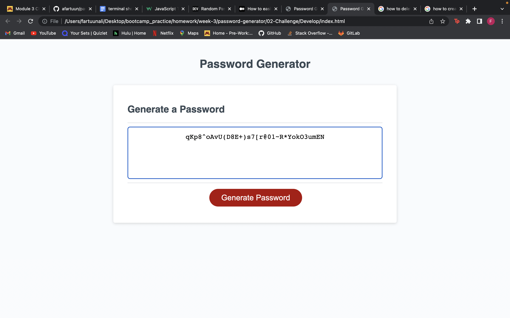

# 03 JavaScript: Password Generator

## What I did
___
### I used the generate characters function to generate the random password by first starting with the prompt which is what asks you to input a number that is betweeen 8 and 128 characters. 
I then set the requirements using an if statement. Then I added confirmations on whether they wanted uppercase, lowercase, special, or number characters.I then had a for statement that randomized the numbers that generated the password. 

## My generated password Mock up
---

